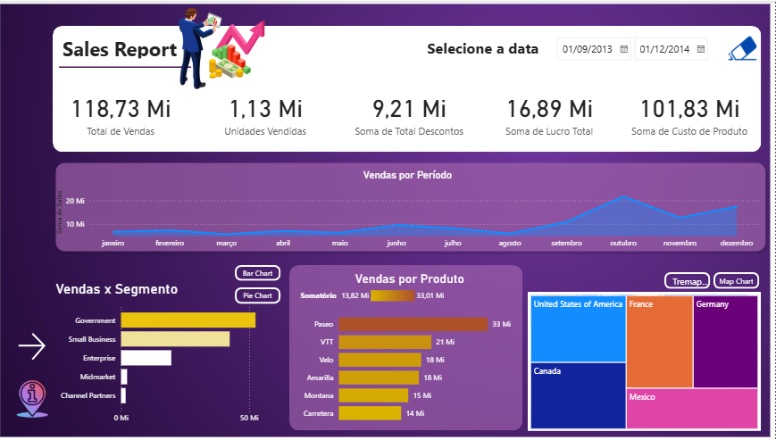

# dio-powerbi-sales-report
Relatório Financeiro e de Vendas desenvolvido no curso Power BI Analyst da DIO.
# 📊 Sales Report - Relatório Financeiro e de Vendas em Power BI

## 📌 Sobre o Projeto
Este repositório contém o relatório financeiro de vendas desenvolvido como parte do desafio prático do curso **Power BI Analyst** na [DIO](https://www.dio.me/).

O objetivo deste painel é apresentar métricas comerciais essenciais para apoio à tomada de decisão, permitindo analisar vendas por segmento, produto, período e localização geográfica.

---

## 📸 Telas do Relatório

### 🏠 Home Page

### 📈 Painel Principal

---

## 🔍 Principais Indicadores (KPIs) e Visualizações
- **Total de Vendas:** Faturamento bruto obtido no período.
- **Unidades Vendidas:** Volume total de produtos comercializados.
- **Total de Descontos:** Montante concedido em promoções/abatimentos.
- **Lucro Total:** Margem líquida obtida após custos.
- **Custo de Produto (COGS):** Custo dos bens vendidos.
- **Análises Dimensionais:**
  - Evolução de vendas por período (linha temporal).
  - Vendas por Segmento de mercado.
  - Ranking de vendas por Produto.
  - Distribuição geográfica de vendas por País (Treemap).

---

## 🛠️ Tecnologias Utilizadas
- **Power BI Desktop:** Construção do layout, visualização interativa e navegação.
- **Power Query:** Limpeza e transformação de dados.
- **DAX:** Criação de métricas e colunas calculadas.

---

## 🚀 Como Visualizar
1. Faça o download do arquivo `sales report.pbix` localizado na pasta `/report`.
2. Abra o arquivo no **Power BI Desktop**.
3. Navegue pelas páginas utilizando os botões de ação do relatório.

---

## 👤 Autor
Desenvolvido por **[Nadijane de Souza]**  
- [LinkedIn](www.linkedin.com/in/nadijane-souza-)  
- [GitHub](https://github.com/Nadi0301/dio-power-sales-report)
